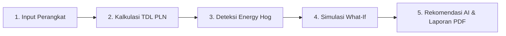

# ⚡ SaveBill — Audit Energi & Simulasi Tagihan Listrik Rumah Tangga

[](https://nextjs.org/)
[](https://golang.org/)
[](https://supabase.com/)
[](https://tailwindcss.com/)
[](https://ai.google.dev/)

> **SaveBill** adalah platform web modern untuk melakukan audit energi mandiri, menghitung estimasi tagihan listrik PLN secara presisi, mendeteksi peralatan boros listrik (*Energy Hog*), serta memberikan rekomendasi penghematan energi berbasis AI tanpa memerlukan perangkat keras tambahan.

---

## 📌 Apa itu SaveBill?

Di Indonesia, meteran listrik PLN (paskabayar maupun prabayar/token) hanya menampilkan total akumulasi pemakaian kilowatt-hour (kWh). Hal ini sering membuat pemilik rumah kesulitan mengetahui **perangkat mana yang sebenarnya menyedot listrik paling besar** dan **berapa biaya bulanan untuk masing-masing alat**.

**SaveBill** hadir untuk menyelesaikan masalah tersebut dengan menyediakan:
- **Audit Digital Tanpa IoT:** Tanpa perlu membeli sensor fisik mahal atau membongkar instalasi listrik.
- **Transparansi Rumus PLN:** Menggunakan rumus Tarif Dasar Listrik (TDL) resmi dari Kementerian ESDM & PLN.
- **Simulasi & Deteksi Dini:** Mengidentifikasi perangkat boros listrik dan mensimulasikan skenario penghematan sebelum tagihan terbit di akhir bulan.

---

## ✨ Fitur-Fitur Utama

- 🏠 **Manajemen Inventaris Perangkat Rumah**
  Pilih dari katalog preset (AC, Kulkas, TV, Pompa Air, Mesin Cuci, dll.) atau tambahkan perangkat kustom dengan daya (Watt), jumlah unit, dan estimasi jam pemakaian harian.
- 📐 **Kalkulasi Presisi Berdasarkan Tarif TDL PLN**
  Mendukung berbagai golongan daya PLN (900 VA, 1.300 VA, 2.200 VA, 3.500 VA, hingga 5.500+ VA) untuk menghitung konsumsi harian/bulanan dalam kWh dan Rupiah.
- 🚨 **Deteksi Otomatis *Energy Hog***
  Sistem secara otomatis mendeteksi jika terdapat perangkat elektronik yang mengonsumsi daya lebih dari **40% dari total tagihan bulanan** Anda.
- 🎛️ **Simulator Interaktif "What-If"**
  Fitur interaktif untuk menyesuaikan durasi pemakaian (misal: mengurangi jam nyala AC dari 10 jam menjadi 7 jam) dan melihat langsung potensi penghematan Rupiah secara *real-time*.
- 🤖 **AI Energy Advisor (Asisten Hemat Energi)**
  Memberikan rekomendasi hemat listrik yang dipersonalisasi berdasarkan susunan perangkat rumah tangga Anda menggunakan integrasi kecerdasan buatan.
- 📄 **Ekspor Laporan Audit PDF**
  Cetak atau unduh ringkasan audit energi rumah tangga dalam bentuk dokumen PDF yang rapi dan profesional.
- 📊 **Dashboard & Analytics**
  Visualisasi grafik konsumsi listrik berdasarkan ruangan (Kamar, Dapur, Ruang Tamu) dan kategori perangkat.

---

## 🔄 Cara Kerja SaveBill



1. **Input Perangkat Elektronik**
   Pengguna menginput peralatan elektronik di rumah beserta estimasi jam penggunaan harian.
2. **Kalkulasi Otomatis**
   SaveBill menghitung total kWh menggunakan rumus standar:
   $$\text{Konsumsi Harian (kWh)} = \frac{\text{Watt} \times \text{Jumlah Unit} \times \text{Jam Pakai}}{1000}$$
   $$\text{Estimasi Biaya Bulanan (Rp)} = (\text{Konsumsi Harian} \times 30) \times \text{Tarif PLN per kWh}$$
3. **Analisis & Notifikasi**
   Sistem mengelompokkan penggunaan daya dan memberi tanda khusus jika ada peralatan yang mendominasi tagihan.
4. **Simulasi Penghematan**
   Pengguna dapat menggeser kontrol durasi untuk menentukan target penghematan bulanan yang realistis.

---

## 🛠️ Arsitektur & Teknologi

* **Frontend:** Next.js (App Router), React, Tailwind CSS, Framer Motion, Recharts.
* **Backend:** Go (Golang) dengan router Chi RESTful API.
* **Database & Autentikasi:** Supabase / PostgreSQL.
* **Kecerdasan Buatan:** Google Gemini API untuk analisis rekomendasi energi.

---

## 🚀 Panduan Memulai (Pengembangan Lokal)

### Prasyarat
- [Node.js](https://nodejs.org/) (v18+)
- [Go](https://golang.org/) (v1.22+)
- Akun [Supabase](https://supabase.com/) & Google AI Studio Key (untuk fitur AI)

### 1. Clone Repository
```bash
git clone https://github.com/username/savebill.git
cd savebill
```

### 2. Konfigurasi Frontend
```bash
cd frontend
npm install
```
Buat file `.env.local` berdasarkan `.env.local.example`:
```env
NEXT_PUBLIC_SUPABASE_URL=your_supabase_url
NEXT_PUBLIC_SUPABASE_ANON_KEY=your_supabase_anon_key
NEXT_PUBLIC_API_BASE_URL=http://localhost:8080/api
```
Jalankan frontend:
```bash
npm run dev
```

### 3. Konfigurasi Backend
```bash
cd ../backend
go mod download
```
Buat file `.env` berdasarkan `.env.example`:
```env
PORT=8080
DATABASE_URL=your_postgres_connection_string
GEMINI_API_KEY=your_gemini_api_key
JWT_SECRET=your_jwt_secret
```
Jalankan backend:
```bash
go run cmd/main.go
```

Buka [http://localhost:3000](http://localhost:3000) pada browser Anda.

---

## 🔒 Privasi & Keamanan Data

SaveBill dirancang dengan memprioritaskan privasi pengguna:
* **Tanpa Integrasi Fisik Direct-Access:** Tidak mengakses atau memodifikasi perangkat keras listrik fisik.
* **Prinsip Minimasi Data:** Hanya menyimpan data inventaris perangkat yang diinput secara sukarela oleh pengguna untuk keperluan perhitungan.
* **Enkripsi Standard:** Seluruh komunikasi data menggunakan HTTPS/TLS terenkripsi.

---

## 📜 Lisensi

Proyek ini dilindungi di bawah lisensi [MIT License](LICENSE).
